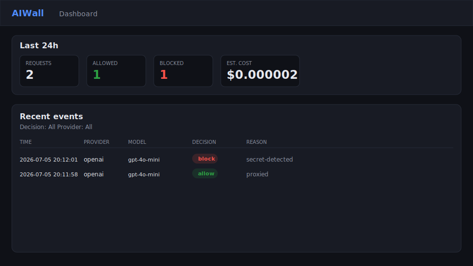

# AIWall

Self-hosted AI security gateway for homelabs, developers, and teams.

AIWall sits between your applications and AI providers and gives you visibility, policy enforcement, secret scanning, audit logging, and cost tracking — on your own hardware, without paying for big-tech cloud solutions.

> AIWall is to AI traffic what Firewalla is to home networks.

## Status

**Phase 1 (Community MVP) is complete.** Phase 2 adds stronger developer secret protection.

| Component | Status |
|---|---|
| FastAPI skeleton + `/healthz` + config loader | Done (Phase 1.1) |
| OpenAI-compatible proxy (`/v1/chat/completions`, SSE streaming) | Done (Phase 1.2) |
| Ollama adapter + provider router | Done (Phase 1.3) |
| Audit logging (SQLite) | Done (Phase 1.4) |
| Policy engine (allow / warn / block / redact) | Done (Phase 1.5 + 2.4) |
| Secret scanning | Done (Phase 1.6) |
| Token counting + cost estimation | Done (Phase 1.7) |
| Web dashboard (events, summary, HTMX filters) | Done (Phase 1.8) |
| Docker image + Compose + healthcheck | Done (Phase 1.9) |
| Demo script + README quickstart | Done (Phase 1.10b) |
| Architecture + configuration docs | Done (Phase 1.10c) |
| `GET /v1/models` | Done (Phase 1.11) |
| Optional gateway auth (`gateway_auth`) | Done (Phase 1.12) |
| CI + lint (ruff, GitHub Actions) | Done (Phase 1.13) |
| Policy engine reload caching | Done (Phase 1.14) |
| Secret scanner rule pack expansion | Done (Phase 2.1) |
| Entropy-based secret detection | Done (Phase 2.2) |
| False-positive tuning (allowlists) | Done (Phase 2.3) |
| Redact matched secrets before forward | Done (Phase 2.4) |
| Privacy-safe block responses (rule ids) | Done (Phase 2.5) |
| `.env` / pasted-config heuristics | Planned (Phase 2.6) |

## What AIWall Does

- **Proxies AI API traffic** — drop-in OpenAI-compatible endpoint for clients, scripts, and coding tools (Cursor, Claude Code, Continue.dev)
- **Scans for secrets** — detect API keys, tokens, SSH keys, and `.env` content before they reach a provider
- **Enforces policies** — allow, warn, block, or redact based on rules you can toggle from the GUI
- **Shows everything in a web control panel** — dashboard, event log, model usage, cost breakdown, policy management
- **Alerts you** — Telegram, webhook, or ntfy notification when something risky is blocked
- **Logs decisions** — privacy-preserving audit trail (raw prompts logged only if you opt in)
- **Tracks cost** — token counts and estimated spend by provider and model

## What AIWall Does Not Do

AIWall governs traffic from clients you control — anything with a configurable base URL or that you self-host. It **cannot** monitor or control commercial chatbot apps on phones (ChatGPT app, Character.AI, Gemini): those use pinned TLS certificates with no configurable endpoint. On-device app control belongs to Apple Screen Time, Google Family Link, and MDM tools.

## Family Use (Self-Hosted)

If you run your own AI stack, AIWall supports household profiles: give a child an account on your self-hosted chat UI (e.g. Open WebUI) routed through AIWall, with per-profile policies, daily limits, and usage summaries. The parent controls the client, so no traffic interception is needed.

## Editions

| Edition | License | Audience |
|---|---|---|
| **AIWall Community** | Apache-2.0 (this repo) | Homelab users, developers, self-hosters |
| **AIWall Pro** | Commercial | Power users, small teams, consultants |
| **AIWall Enterprise** | Commercial | Regulated organizations, security teams |

Community edition is designed to be genuinely useful on its own. Pro and Enterprise features ship as separate modules.

## Related Repositories

| Repository | Purpose |
|---|---|
| [AIWall](https://github.com/MohsenBah/AIWall) | Core product — proxy, policies, control panel |
| [AIWall-detections](https://github.com/MohsenBah/AIWall-detections) | Wazuh rules, Sigma rules, Grafana dashboards, SIEM content |
| [AIWall-redteam](https://github.com/MohsenBah/AIWall-redteam) | Adversarial testing payloads and mitigation validation |

## Quick Start (~15 minutes)

Get AIWall running, proxy a request, trigger a secret block, and see it on the dashboard.

### 1. Start AIWall (Docker — recommended)

```bash
git clone https://github.com/MohsenBah/AIWall.git
cd AIWall
docker compose -f deploy/docker-compose.yml up --build -d
curl http://127.0.0.1:8080/healthz
```

Optional: add local Ollama for `llama*` models:

```bash
docker compose -f deploy/docker-compose.yml --profile ollama up --build -d
```

Copy `deploy/.env.example` to `.env` to set `OPENAI_API_KEY`, `AIWALL_PORT`, or other secrets.

### 2. Run the demo

```bash
./scripts/demo.sh
```

This sends one normal request and one secret-leak request, then prints recent audit rows. The secret request should return **HTTP 403** with `policy_blocked`.

For a successful **allow** row, set `OPENAI_API_KEY` or run with the Ollama profile.

### 3. Open the dashboard

Visit [http://127.0.0.1:8080/](http://127.0.0.1:8080/) — summary cards (requests, allow/warn/block counts, estimated cost) and a filterable event log.



You should see at least one **block** row with reason `secret-detected` after running the demo.

### 4. Point a client at AIWall

Use AIWall as your OpenAI-compatible base URL:

```text
http://127.0.0.1:8080/v1
```

Example with curl:

```bash
curl http://127.0.0.1:8080/v1/chat/completions \
  -H "Authorization: Bearer $OPENAI_API_KEY" \
  -H "Content-Type: application/json" \
  -d '{"model":"gpt-4o-mini","messages":[{"role":"user","content":"hello"}]}'
```

Coding tools (Cursor, Continue.dev, etc.): set the OpenAI base URL to `http://127.0.0.1:8080/v1` instead of `https://api.openai.com/v1`.

### Local development (without Docker)

```bash
python3 -m venv .venv
source .venv/bin/activate
pip install -e ".[dev]"
cp aiwall.yaml.example aiwall.yaml   # optional: customize providers/policies
cp prices.yaml.example prices.yaml   # optional: cost estimation
./scripts/dev.sh
```

In another terminal:

```bash
curl http://127.0.0.1:8080/healthz
./scripts/demo.sh
```

SQLite audit data is stored at `data/aiwall.db` by default.

### Environment variables

| Variable | Default | Description |
|---|---|---|
| `AIWALL_CONFIG` | `aiwall.yaml` (local) / `/app/aiwall.yaml` (Docker) | Path to the AIWall YAML config file |
| `AIWALL_PORT` | `8080` | HTTP port for the proxy and dashboard |
| `OPENAI_API_KEY` | _(unset)_ | API key forwarded to the OpenAI-compatible provider |
| `AIWALL_API_KEY` | _(unset)_ | Client key required when `gateway_auth.enabled: true` |
| `OLLAMA_PORT` | `11434` | Host port when running Ollama via `--profile ollama` |

Edit `deploy/examples/aiwall.docker.yaml` (Docker) or `aiwall.yaml` (local) for providers and policies. Docker persists audit data in the `aiwall_data` volume.

## Architecture

```text
AI Application (script, coding tool, Open WebUI, ...)
    |
    v
AIWall Proxy  (/v1/chat/completions, /healthz, dashboard at /)
    |
    +-- Policy Engine
    +-- Secret Scanner
    +-- Cost Estimator
    +-- Provider Router
    +-- Audit Logger ----> Web Control Panel + Alerts (planned)
    |
    v
AI Provider (OpenAI-compatible, Ollama, ...)
```

**Stack:** Python 3.12, FastAPI, SQLite, Jinja2 + HTMX control panel, Docker.

## Configuration

Clients point their base URL to AIWall:

```text
http://aiwall-host:8080/v1
```

Policies and providers are configured in `aiwall.yaml`. See [docs/configuration.md](docs/configuration.md) for the full schema and [docs/architecture.md](docs/architecture.md) for request flow.

## Contributing

Contributions are welcome once the project scaffold lands. External contributions will use a Developer Certificate of Origin (DCO) sign-off — no CLA required.

## License

[Apache License 2.0](LICENSE)

## Background

AIWall builds on ideas explored in [MedSecLab](https://github.com/MohsenBah/MedSecLab) — a simulated healthcare AI security lab — and productizes them for homelab, developer, and enterprise use.
